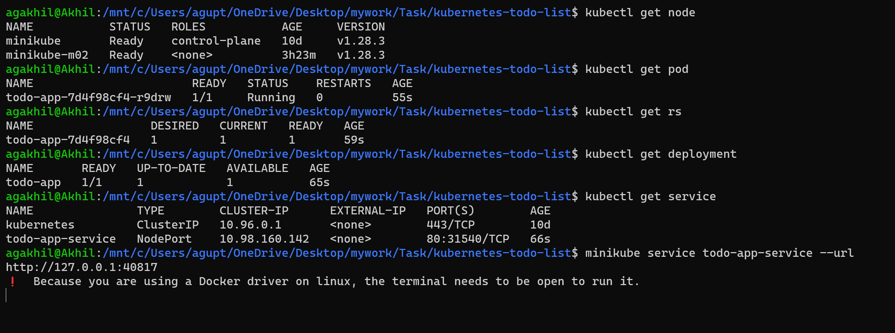
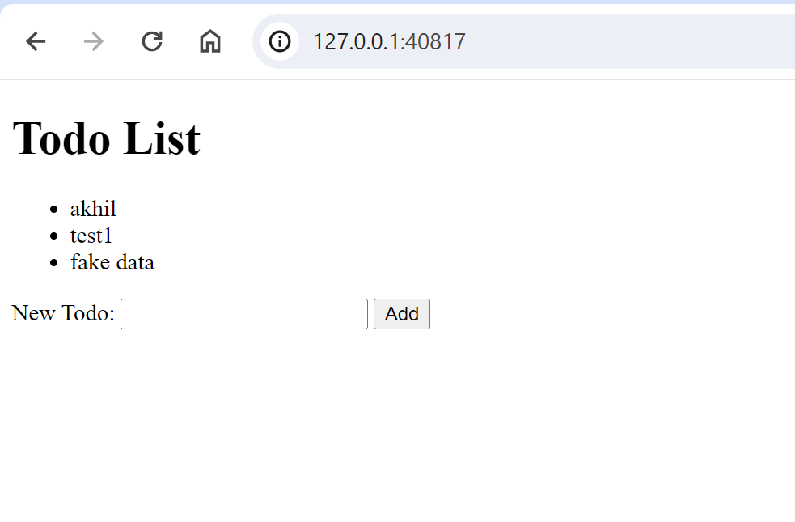

### Create a simple application using any language of your choice that can be deployed to Kubernetes

**About Application:** Simple browser based application to add and display todo list.

#### Folder Structure:
- **app:** This directory contains application related code and `Dockerfile` to build cointer. Image build locally from base image python:3.8 and uploaded on the docker hub repository [todo-app](https://hub.docker.com/r/agakhil13/todo-app/tags)

- **deployment.yaml:** This file contains deployment template to create pods using the image `agakhil13/todo-app:latest` and exposing the port `5000`. Following command can be use to spin up deployment:
```bash
kubectl apply -f deployment.yaml
```

- **service.yaml:** This file contains the sevice template to create service for catering pods created by deployment and map port `5000` to port `80`. Following command can be use to spin up service:
```bash
kubectl apply -f service.yaml
```

- **snip:** This directory contains snapshots of `CLI` and `browser` during application execution:
  - CLI snip: Shows the status of various kubernetes components created during the snip up of application
   
  - Browser snip: Shows the application running on the web browser
     